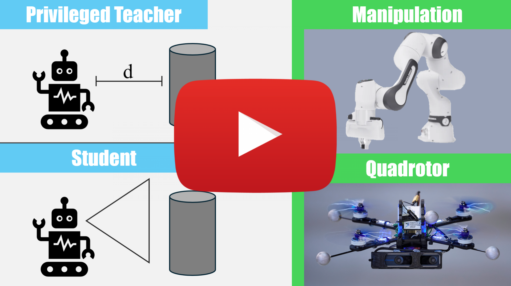
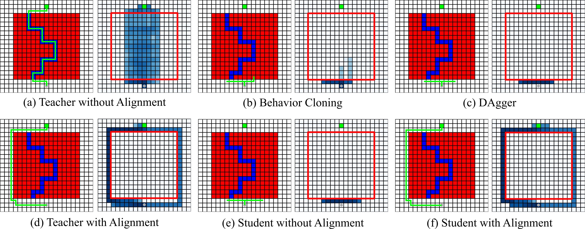

# Student-Informed Teacher Training

<p align="center">
 <a href="https://youtu.be/klFIWKoNo60">
  
 </a>
</p>

This is the code for the ICLR25 Spotlight paper **Student-Informed Teacher Training**
([PDF](https://rpg.ifi.uzh.ch/docs/ICLR25_Messikommer.pdf)) by [Nico Messikommer*](https://messikommernico.github.io/), [Jiaxu Xing*](https://jiaxux.ing/), [Elie Aljalbout](https://eliealjalbout.github.io/), and [Davide Scaramuzza](https://rpg.ifi.uzh.ch/people_scaramuzza.html).
For an overview of our method, check out our [video](https://youtu.be/klFIWKoNo60) and our project [website](https://rpg.ifi.uzh.ch/sitt/).

If you use any of this code, please cite the following publication:

```bibtex
@Article{Messikommer25iclr,
  author  = {Nico Messikommer* and Jiaxu Xing* and Elie Aljalbout and Davide Scaramuzza},
  title   = {Student-Informed Teacher Training},
  journal = {The Thirteenth International Conference on Learning Representations (ICLR)},
  year    = {2025},
}
```

## Abstract

Imitation learning with a privileged teacher has proven effective for learning complex control behaviors from high-dimensional inputs, such as images. In this framework, a teacher is trained with privileged task information, while a student tries to predict the actions of the teacher with more limited observations, e.g., in a robot navigation task, the teacher might have access to distances to nearby obstacles, while the student only receives visual observations of the scene. However, privileged imitation learning faces a key challenge: the student might be unable to imitate the teacher’s behavior due to partial observability. This problem arises because the teacher is trained without considering if the student is capable of imitating the learned behavior. To address this teacher-student asymmetry, we propose a framework for joint training of the teacher and student policies, encouraging the teacher to learn behaviors that can be imitated by the student despite the latters’ limited access to information and its partial observability. Based on the performance bound in imitation learning, we add (i) the approximated action difference between teacher and student as a penalty term to the reward function of the teacher, and (ii) a supervised teacher-student alignment step. We motivate our method with a maze navigation task and demonstrate its effectiveness on complex vision-based quadrotor flight and manipulation tasks.

## Content

This repository contains the code for the Student-Informed Teacher Training applied to the color maze problem. 
The repository does not yet contain the code for training an RL agent for the vision-based quadrotor flight and the vision-based manipulation task. However, using this code base, it is straightforward to implement the student-informed training framework in an other existing simulation tasks.

The main RL framework is Stable-Baselines 3

<p align="center">
  
</p>

## Installation

1. If desired, a conda environment can be created using the following command:

```bash
conda create -n <env> python=3.9

conda activate <env>

conda env update --file environment.yml
```

## Usage
The `train.py` script can be used to train the teacher and student while it also automatically evaluates both agents after the specified numbter of timesteps on evaluation environments.

The default configuration inside the `config.yaml` can be used to reproduce the results in the paper.
The training can be started with the following commadn:

```bash
cd color_maze
python train.py --seed <seed> --result_dir <path>
```

## Important Code Sections
There are three places, in which the most crucial steps of the student-informed teacher framework happen.
These correlate to the training phases explained in the paper.

1. **Roll-out phase** In this phase, the KL-Divergence between teacher and approximate student needs to be computed.
See L204-L225 in `on_policy_algorithm_toy.py`

2. **Policy update phase** In this phase, the teacher weights are additionally changed by backpropagating through KL-Divergence between teacher and approximate student.
See L281-L287 in `ppo_toy.py`


3. **Alignment phase** In this phase, the student is aligned to the teacher and the approximate student to the student.
See `align_policy` function in `on_policy_algorithm_toy.py`

